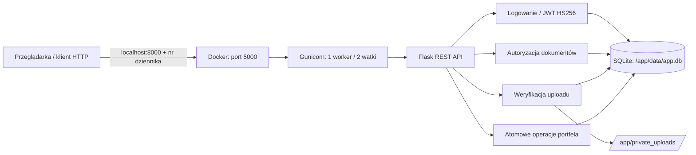
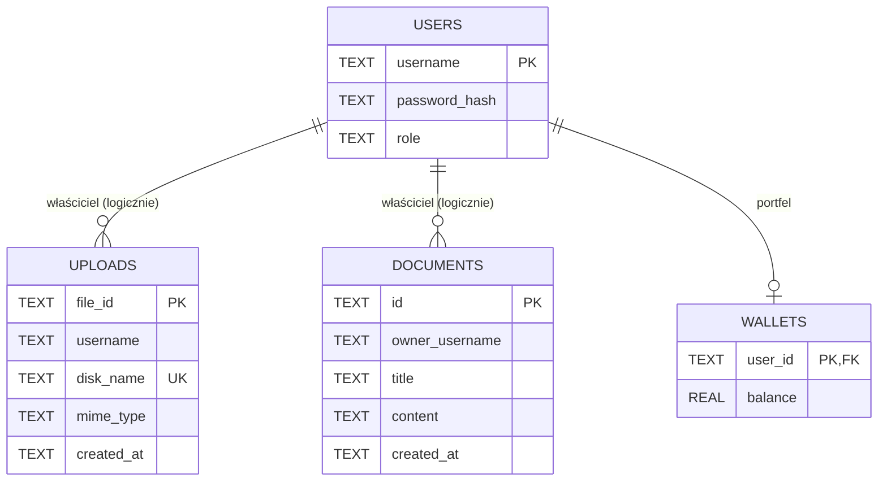

# Flask API: dokumenty, grafiki i portfele

Przykładowa aplikacja webowa powstała podczas praktyk. Udostępnia logowanie JWT, dokumenty użytkowników, przesyłanie obrazów oraz prosty portfel obsługujący współbieżne operacje. Wersja kontenerowa i testy bezpieczeństwa znajdują się w katalogu [`zadanie17/`](zadanie17/). Starsze zadania mogą zostać zachowane jako historia ćwiczeń, ale nie są elementem obrazu aplikacji.

> **Charakter projektu:** rozwiązanie dydaktyczne, a nie gotowa usługa finansowa. Przed udostępnieniem w Internecie wymagane są m.in. trwały współdzielony limiter logowania, pełne dekodowanie plików graficznych oraz przegląd konfiguracji i zależności.

## 1. Architektura



**Technologie:** Python 3.12, Flask, PyJWT, SQLite, Gunicorn, Docker i oficjalny obraz `python:3.12-alpine`. Serwer Gunicorn nasłuchuje na `0.0.0.0:5000`; na hoście port oblicza się jako `8000 + numer z dziennika`. Dane operacyjne trafiają do osobnych katalogów, a kod uruchamia się z konta `appuser`, nie `root`.

**Struktura projektu:**

```text
.
├── README.md                     # ta dokumentacja
├── .gitignore                    # ochrona całego repozytorium
├── .dockerignore                 # ochrona, gdy kontekstem jest korzeń repo
├── scripts/
│   ├── audit_git.ps1             # inspekcja drzewa i nazw plików w historii
│   └── prepare_history_cleanup.ps1
└── zadanie17/
    ├── Dockerfile                # obraz produkcyjny
    ├── .dockerignore             # zasady dla kontekstu zadanie17
    ├── .env.example              # wzór konfiguracji, bez sekretu
    ├── requirements.txt
    ├── requirements-tests.txt
    ├── app.py                    # REST API, autoryzacja i nagłówki
    ├── init_db.py                # schemat SQLite
    ├── init_db_wallet.py
    ├── manage_users.py           # interaktywne tworzenie kont
    ├── run.ps1                   # build i uruchomienie
    ├── inspect.ps1               # inspekcja kontenera
    ├── static/                   # CSS i JavaScript
    ├── templates/                # interfejs HTML
    └── tests/                    # testy pytest i integracyjne
```

## 2. Wymagania i zmienne środowiskowe

Wymagane: Docker Desktop z włączonym Docker Engine, PowerShell oraz Python z `pip` do uruchamiania testów na hoście.

| Zmienna | Wymagana | Znaczenie |
| --- | --- | --- |
| `JWT_SECRET` | **tak** | Długi, losowy sekret podpisu tokenów HS256. Nie zapisuj wartości w Git ani Dockerfile. |
| `APP_PORT` | nie | Wewnętrzny port serwera; domyślnie `5000`. Pozostaw `5000` przy podanych komendach. |
| `SEED_DEMO_DATA` | nie | `0` (domyślnie): bez kont demonstracyjnych. `1`: dodanie znanych kont do ćwiczeń, **wyłącznie na localhost**. |

Kopię pliku `.env` twórz wyłącznie lokalnie. **Nie kopiuj `.env.example` jako gotowego sekretu.** Skrypt `run.ps1` wygeneruje nowy losowy `JWT_SECRET` przy pierwszym uruchomieniu i utworzy ignorowany przez Git plik `.env`.

```powershell
cd zadanie17
.\run.ps1 -NumerDziennika 12
```

Dla numeru `12` serwis będzie dostępny pod **http://localhost:8012** (`8000 + 12`). Numer dziennika podaj własny. Skrypt buduje obraz i uruchamia kontener w tle z ustawieniami `--memory=256m --memory-swap=256m`, `--env-file .env`, `--cap-drop=ALL` i `--security-opt no-new-privileges:true`. Host nasłuchuje domyślnie **tylko na `127.0.0.1`**, co zapobiega przypadkowemu wystawieniu usługi do sieci. Do utrwalania SQLite i uploadów wykorzystywane są osobne wolumeny `sklep17_data` i `sklep17_uploads`.

Alternatywnie można jawnie wykonać polecenia Dockera (po utworzeniu `.env`):

```powershell
cd zadanie17
docker build -t sklep-zadanie17 .
docker run -d --name sklep17 --memory=256m --memory-swap=256m `
  --env-file .env --cap-drop=ALL --security-opt no-new-privileges:true `
  --mount type=volume,src=sklep17_data,dst=/app/data `
  --mount type=volume,src=sklep17_uploads,dst=/app/private_uploads `
  -p 127.0.0.1:8012:5000 sklep-zadanie17
```

Na świeżej bazie nie ma użytkowników, ponieważ dane demonstracyjne są domyślnie wyłączone. Utwórz konto interaktywnie, bez podawania hasła w linii poleceń:

```powershell
docker exec -it sklep17 python manage_users.py --username mojadmin --role admin
```

Dla **lokalnych testów dydaktycznych** ustaw `SEED_DEMO_DATA=1` w `.env` przed uruchomieniem kontenera. Wtedy skrypty inicjalizacyjne dodadzą konta testowe oczekiwane przez wcześniejsze scenariusze (`jan`, `kasia`, `admin`). Te konta i ich przykładowe hasła są publicznie znane z wcześniejszego zadania i **nie nadają się do wdrożenia internetowego**. Aby wrócić do czystej bazy, usuń testowe wolumeny dopiero po świadomym wykonaniu kopii danych.

## 3. Kontrola wdrożenia i zasobów

```powershell
.\inspect.ps1 -NumerDziennika 12
docker ps
docker exec sklep17 whoami
docker exec sklep17 id
docker stats --no-stream sklep17
docker inspect sklep17 --format '{{.HostConfig.Memory}}'
```

Oczekiwane: `whoami` zwraca `appuser`; UID i GID są różne od `0`; limit pamięci to `268435456` bajtów (256 MiB). Zapis do `/app` powinien być blokowany; zapis do `/app/data` i `/app/private_uploads` jest dozwolony. Test obecności nagłówków: `curl.exe -I http://localhost:8012/` (lub `curl.exe -D - http://localhost:8012/` dla obsługi GET).

Sprawdź, czy czysty obraz nie zawiera `.env`, bazy ani katalogów deweloperskich:

```powershell
docker run --rm --entrypoint sh sklep-zadanie17 -c 'find /app -name .env -o -name "*.db" -o -name .git -o -name .venv'
```

Polecenie `docker inspect` pokazuje konfigurację kontenera, w tym zmienne środowiskowe. **Nie publikuj pełnego wyniku inspect, jeśli podajesz sekret przez `--env-file`.**

## 4. Zastosowane zabezpieczenia i ograniczenia

| Obszar | Mechanizm w aplikacji | Uwagi i ograniczenia |
| --- | --- | --- |
| **SQL Injection** | Wszystkie zapytania wykorzystujące dane użytkownika przekazują parametry przez `sqlite3.execute(..., params)`, a nie sklejanie tekstu SQL. | W przyszłych zmianach nie interpoluj identyfikatorów SQL ani fragmentów `WHERE`. |
| **XSS** | Szablon HTML nie renderuje niezweryfikowanych danych jako HTML; w JS do komunikatów stosowane jest `textContent`. Ustawiono CSP (`script-src 'self'`, `object-src 'none'`, `frame-ancestors 'none'`), `X-Content-Type-Options: nosniff`, `X-Frame-Options: DENY` i `Referrer-Policy`. | CSP ogranicza skutki wybranych klas XSS, nie zastępuje walidacji/escape danych we wszystkich przyszłych widokach. |
| **IDOR** | Trasy dokumentów ograniczają `SELECT`/`UPDATE` do właściciela lub administratora; pobieranie plików także sprawdza właściciela. | Sprawdzaj dostęp w każdej nowej trasie operującej na identyfikatorze zasobu. |
| **Race Condition** | Portfel stosuje pojedynczą instrukcję `UPDATE wallets SET balance = balance - ? WHERE user_id = ? AND balance >= ?` i sprawdza `rowcount`. | Kwoty w `REAL` są odpowiednie do zadania, nie do rzeczywistych finansów: dla pieniędzy stosuj jednostki całkowite lub typ dziesiętny. |
| **Upload** | Limit 5 MiB, odczyt sygnatur PNG/JPEG, losowa nazwa na dysku, katalog prywatny i uprawnienia zapisu tylko dla `appuser`. Nazwa klienta nie wskazuje docelowej ścieżki. | Weryfikacja nagłówka/końca pliku **nie gwarantuje**, że obraz można poprawnie zdekodować. W publicznym produkcyjnym systemie dodaj pełny dekoder/rekodowanie i skanowanie zawartości. |
| **JWT** | Wymagany sekret z `JWT_SECRET`, sprawdzanie podpisu HS256 i wymaganych roszczeń `sub`, `role`, `exp`; błędne i wygasłe tokeny otrzymują `401`. | Zarządzaj rotacją sekretów, czasem ważności i unieważnianiem tokenów. Nie umieszczaj JWT w repozytorium ani w logach. |
| **Rate Limiting** | 5 błędnych logowań na IP powoduje `429` i nagłówek `Retry-After`; blokada trwa 60 s. | Limiter jest **w pamięci jednego procesu** Gunicorn; dla wielu replik i środowiska publicznego użyj np. Redis oraz kontroli zaufanych proxy. |
| **Kontener** | Alpine, dedykowany `appuser` bez interaktywnego shella, katalogi aplikacji tylko do odczytu, minimalne uprawnienia i limit 256 MiB. | Nie używaj niezaufanych obrazów ani trybu privileged. Aktualizuj bazę i zależności. |

## 5. Schemat bazy SQLite



`wallets.user_id` ma deklarację klucza obcego do `users.username`. `uploads.username` i `documents.owner_username` reprezentują relacje **logiczne**, obecny schemat nie deklaruje dla nich `FOREIGN KEY`. SQLite wymaga ponadto włączenia `PRAGMA foreign_keys=ON` na każdym połączeniu, aby wymuszać zadeklarowane ograniczenia. Tego nie należy mylić z kontrolą autoryzacji HTTP.

## 6. Testy automatyczne

```powershell
cd zadanie17
python -m pip install -r requirements.txt -r requirements-tests.txt
python -m pytest -v tests/test_security_pytest.py
```

Testy pytest obejmują zmieniony, wygasły i niepoprawnie podpisany JWT, fałszywe PNG/JPEG, odczyt i zmianę cudzych dokumentów (IDOR) oraz `429` z `Retry-After`. Fixture przygotowuje odrębną bazę i katalog uploadów, więc nie modyfikuje danych kontenera. Pozostałe skrypty w `tests/` są testami integracyjnymi HTTP i wymagają uruchomionej lokalnej aplikacji oraz danych demonstracyjnych (`SEED_DEMO_DATA=1`):

```powershell
python tests/test_security_headers.py --url http://localhost:8012
python tests/test_auth_isolation.py --url http://localhost:8012
python tests/test_upload.py --url http://localhost:8012
python tests/test_race_condition.py --url http://localhost:8012
```

`test_race_condition.py` **zmienia saldo**, dlatego wykonuj go na świeżej demonstracyjnej bazie. Uruchomienie testów i końcowy wynik należy potwierdzić na docelowym komputerze; samo przygotowanie kodu nie zastępuje ich rzeczywistego wykonania.

## 7. Higiena repozytorium i czyszczenie historii

Pliki `.gitignore` zapobiegają przypadkowemu dodaniu `.env`, baz, uploadów, cache Pythona, wirtualnych środowisk i plików tymczasowych. `.dockerignore` chroni kontekst budowania, a **Dockerfile używa jawnych instrukcji `COPY`**, zamiast kopiować cały katalog w ciemno. Reguły ignorowania nie usuwają jednak plików już zapisanych w historii Git.

Jeżeli korzystasz z tej paczki poza repozytorium, możesz najpierw wgrać przygotowane pliki i oznaczyć stare skrypty do usunięcia (bez automatycznego commita/pusha):

```powershell
.\scripts\finish_repo.ps1 -RepoPath C:\sciezka\do\praktyki
```

Zweryfikuj drzewo i nazwy obiektów w historii:

```powershell
.\scripts\audit_git.ps1
git status --short
git ls-files
git log --all --name-only --format="%h %s"
```

W oryginalnym repozytorium z końca września 2026 znajdował się **jeden commit** z kodem `zadanie13`; nie stwierdzono w nim śledzonych `.env` ani lokalnych baz SQLite. Widoczne były jednak stare skrypty demonstracyjne/audytowe: `app_wallet_vuln.py`, `audit_race_condition.py`, `exploit.py` i `exploit_audit.py`. Do aktualnego drzewa produkcyjnego nie są potrzebne; testy należy trzymać w `tests/`.

Jeżeli wymagana jest **trwała eliminacja ścieżek także z historii**, najpierw wykonaj kopię i uzgodnij zmianę historii ze współpracownikami. Wymaga to `git-filter-repo`:

```powershell
python -m pip install git-filter-repo
.\scripts\prepare_history_cleanup.ps1
```

Skrypt tworzy **dwa lokalne lustrzane klony** (kopia bezpieczeństwa i wersja oczyszczona), filtruje tylko określone ścieżki i wypisuje polecenia do ręcznej weryfikacji i późniejszego `--force-with-lease`. **Nie wykonuje automatycznego force push.** Po zmianie historii inni współpracownicy powinni wykonać nowy klon. GitHub, starsze klony i forki mogą nadal zachować stare obiekty; wszelkie ujawnione rzeczywiste sekrety muszą zostać **unieważnione i zastąpione**.

## 8. Zatrzymanie środowiska

```powershell
docker stop sklep17
docker rm sklep17
```

Te polecenia **nie usuwają wolumenów**, więc dane SQLite i uploady pozostają zachowane. Przed usunięciem wolumenów wykonaj świadomie kopię zapasową.
